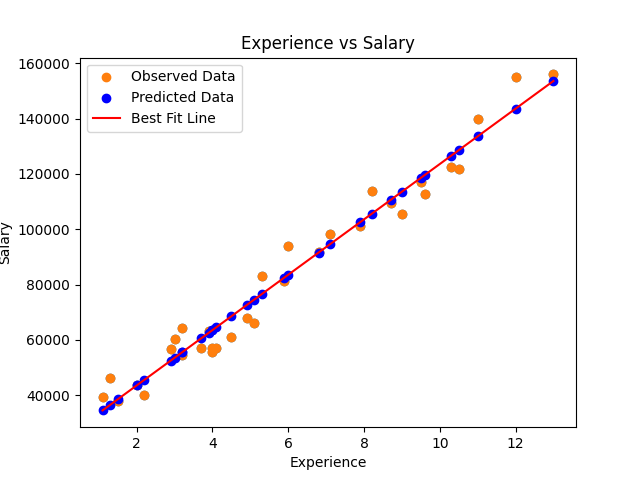

"""
# Experience vs Salary Prediction

This program demonstrates how to use a simple linear regression model to predict salaries based on years of experience. The dataset used contains two columns: `Experience` (in years) and `Salary`.

## Features of the Program

1. **Data Loading**:
    ```python
    # Load the dataset from a CSV file
    data = pd.read_csv('salary_data.csv')
    ```
    - The dataset is loaded from a CSV file named `salary_data.csv`.

2. **Data Visualization**:
    ```python
    # Create a scatter plot to visualize the relationship
    # Plot scatter graph
    # Visualize the data
    # A scatter plot is a graph that shows the relationship between two variables
    # The x-axis represents one variable, and the y-axis represents the other
    # Each point on the graph represents a single observation
    # Scatter plots are used to see if there is a relationship between two variables
    # Scatter plots are used to see if there is a correlation between two variables
    # Scatter plots are used to see if there is a pattern between two variables
    # Scatter plots are used to see if there is a trend between two variables
    plt.scatter(data['Experience'], data['Salary'])
    plt.xlabel('Experience (Years)')
    plt.ylabel('Salary')
    plt.title('Experience vs Salary')
    ```
    - A scatter plot is created to visualize the relationship between `Experience` and `Salary`.

3. **Statistical Analysis**:
    - Covariance and correlation between `Experience` and `Salary` are calculated to understand the relationship between the two variables.
    ### Covariance
        - Find covariance (Find is there any relation between two variables)
        - Covariance is a measure of how much two variables change together
        - Positive covariance means that the variables are directly proportional
        - Negative covariance means that the variables are inversely proportional
        - Zero covariance means that the variables are not related
        - Covariance can be any value
        - Covariance is not normalized,standardized,bounded,percentage,probability,correlation
        - Covariance of x and y = Σ((x - mean(x)) * (y - mean(y))) / (n-1)
        - Covariance of x = Covariance of y
        - [[cov(x,y)]] = cov(x,x) = cov(y,y)

    ```python
    covariance = np.cov(data['Experience'], data['Salary'])[0, 1]
    ```
    ### Correlation
        - Find correlation (Relation is stron ok)
        - Correlation is a normalized form of covariance
        - It is a measure of how much two variables change together
        - Correlation ranges from -1 to 1
        - 1 means that the variables are perfectly correlated
        - 0 means that the variables are not correlated
        - -1 means that the variables are perfectly inversely correlated
    ```python
    correlation = np.corrcoef(data['Experience'], data['Salary'])[0, 1]
    ```

4. **Separate Features (data/variable)**:    
    ```python
    x = df.drop('Salary', axis=1)
    y=df['Salary']
    ```
    - Separate the features (independent variables) and the target (dependent variable)
    - Why drop function ? : We are using drop since independent variable should be two dimention array
    - Why x is 2D array ? : x is 2D array since it is independent variable
    - Why axis=1 ? : axis=1 means we are dropping column
    - Why axis=0 ? : axis=0 means we are dropping row
    - Why x and y ? : x is independent variable and y is dependent variable as per convention

5. **Model Training**:
    ```python
        # Train a linear regression model
        model = LinearRegression()
        model.f
        it(data[['Experience']], data['Salary'])
    ```
            # A linear regression model is trained using the `Experience` as the independent variable and `Salary` as the dependent variable.
            # Initialize the Linear Regression model
            # Why Linear Regression ? : Linear regression is used for regression problems
            # Regression is used to predict a continuous value
            # Linear regression is used to predict a continuous value using one or more independent variables
            # Linear regression is used to predict a continuous value using a linear equation
            # Linear regression is used to predict a continuous value using a straight line


6. **Prediction**:
    ```python
    # Predict salary for a given number of years of experience
    years_of_experience = 5
    predicted_salary = model.predict([[years_of_experience]])
    print(f"Salary of {years_of_experience} years of experience is: {predicted_salary[0]}")
    ```
        # The program predicts the salary for a given number of years of experience (e.g., 5 years).
        # Predict the salary for 15 years of experience
        # Why model.predict ? : model.predict is used to predict the value
        # Why pd.DataFrame ? : pd.DataFrame is used to create a data frame
        # Why predict need DataFrame ? : predict need DataFrame to predict the value and it should be 2D array
        # DataFrame is a 2D labeled data structure with columns of potentially different types
        # It is generally the most commonly used pandas object
        # Like an SQL table or Excel spreadsheet

7. **Visualize Best fit regerssion line**
    - Linear Regression analysis is find the formula of closest relation between independent and dependent data.
    - On the basis of relation (formuala) predect the dependent value on the basis given independent data
    - To visualise the relation also called as best fit line below code is used
    ```python
        plt.scatter(df['Experience'], df['Salary'],label='Observed Data')
        plt.scatter(df['Experience'], model.predict(x), color='blue',label='Predicted Data')
        plt.plot(df['Experience'], model.predict(x), color='red',label='Best Fit Line')
        plt.legend()
        plt.show()  # Uncomment to see graph
    ```

    ```markdown
    
    ```

## Notes
- Ensure the dataset is clean and contains no missing values for accurate predictions.
- Dependent variables must be numbers if not we need to convert them (will see later)
- Independent variable must be always 2D 
- The model assumes a linear relationship between `Experience` and `Salary`.
- Modify the `pd.DataFrame` input in the `model.predict` function to predict salaries for other experience values.
- We use regression analysis becaues there is Linear relation, if there is spontanious relation we would have used Polinomial Regreesion

