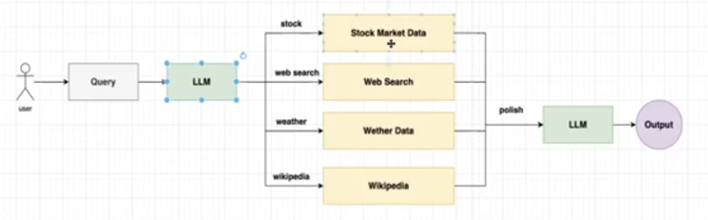

# LLM-Based Query Processing System

This project illustrates how to use a Large Language Model (LLM) to process user questions, generate database queries, and return meaningful final answers.

## 📊 System Architecture

The flowchart below represents the data flow in the system:

### 🔁 Flow Description

1. **User Input**: A user inputs a natural language question.
2. **Prompt Preparation**: The system constructs a prompt using the question and database schema metadata.
3. **LLM - Query Generation**: The LLM receives the prompt and generates a database query.
4. **Database Interaction**: The generated query is executed on the database.
5. **Query Result Formatting**:
   - The raw result is passed back to the LLM with a formatting prompt.
   - The LLM transforms the result into a human-readable final response.

---

## 🔧 Components

- **LLM**: Can be OpenAI, LLaMA 3, Mistral, etc.
- **Database**: SQL/NoSQL backend (e.g., PostgreSQL, MongoDB).
- **Prompt Templates**: Used to guide LLM behavior during query generation and result formatting.

## ✅ Use Cases

- Natural language database querying
- AI-powered business intelligence dashboards
- Semantic search over structured data

---

## 📁 File Info

- `block_diagram.png`: Visual block diagram used in this markdown file

---

## 📌 Requirements

- Python >= 3.8
- LangChain (for LLM integration)
- Database drivers (psycopg2, pymongo, etc.)

