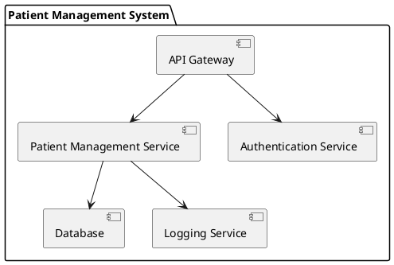
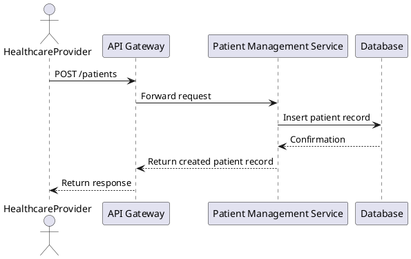
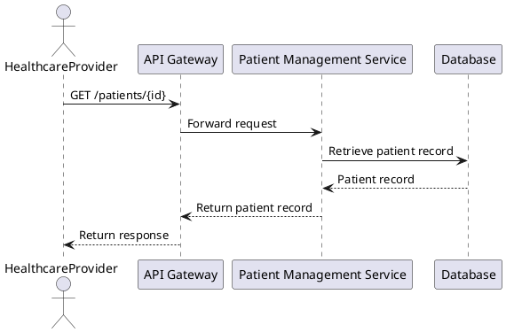

# Patient Management API Architecture Document

## 1. Overview
This document outlines the software architecture for the Patient Management API, which is designed to manage patient records within a healthcare system. The architecture follows standard patterns to ensure scalability, security, and maintainability.

## 2. Architecture Pattern
The architecture follows a Microservices pattern, where the API is designed as a standalone service that interacts with a relational database for data persistence. This allows for independent scaling and deployment of the API service.

## 3. Components
- **API Gateway**: Acts as a single entry point for all client requests, routing them to the appropriate microservice.
- **Patient Management Service**: Handles all CRUD operations related to patient records.
- **Database**: A relational database (e.g., PostgreSQL) for storing patient records.
- **Authentication Service**: Manages user authentication and authorization.
- **Logging Service**: Captures logs for monitoring and debugging purposes.

## 4. Data Flow
1. **Client Request**: A healthcare provider sends a request to the API Gateway.
2. **Routing**: The API Gateway routes the request to the Patient Management Service.
3. **Service Processing**: The Patient Management Service processes the request, interacting with the Database as needed.
4. **Response**: The service sends the response back to the API Gateway, which forwards it to the client.

## 5. Security Considerations
- **Authentication**: All requests must be authenticated using OAuth2 tokens.
- **Authorization**: Role-based access control (RBAC) ensures that only authorized users can perform specific actions.
- **Data Encryption**: Sensitive data is encrypted both in transit (using HTTPS) and at rest (using database encryption).

## 6. Scalability
- **Horizontal Scaling**: The Patient Management Service can be scaled horizontally by deploying multiple instances behind a load balancer.
- **Database Sharding**: As the number of records grows, the database can be sharded to distribute the load.

## 7. Maintainability
- **Microservices**: Each component can be developed, deployed, and maintained independently.
- **Logging and Monitoring**: Centralized logging and monitoring facilitate quick identification of issues.

## 8. PlantUML Diagrams

### 8.1 Component Diagram

### 8.2 Sequence Diagram for Create Patient Record

### 8.3 Sequence Diagram for Read Patient Record

## 9. Conclusion
The Patient Management API architecture is designed to be secure, scalable, and maintainable. By following a microservices architecture and implementing best practices for security and data management, the system will effectively meet the needs of healthcare providers while ensuring compliance with regulations.