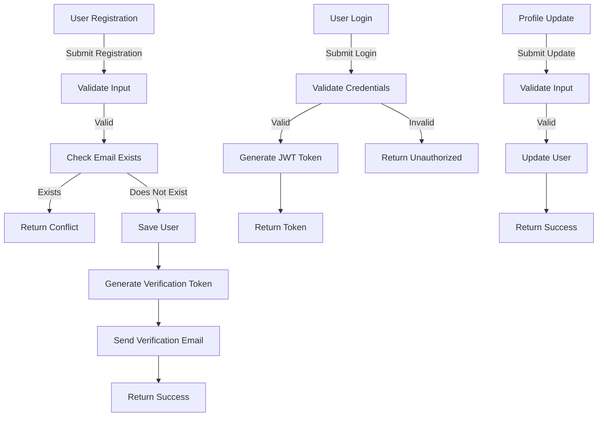

```markdown
# Java API Design Document for User Registration, Login, and Profile Update with Email Verification

## High-Level Architecture

The architecture consists of the following components:

- **Presentation Layer**: Handles incoming HTTP requests and responses.
- **Service Layer**: Contains business logic for user registration, login, and profile updates.
- **Data Access Layer**: Interacts with the database to perform CRUD operations.
- **Email Service**: Sends verification emails to users.
- **Security Layer**: Manages authentication and authorization.

### Components

- **Controller**: Manages API endpoints.
- **Service**: Contains business logic.
- **Repository**: Interacts with the database.
- **DTOs**: Data Transfer Objects for API requests and responses.
- **Entity**: Represents database tables.
- **Email Service**: Sends verification emails.

## API Endpoints

### 1. User Registration

- **HTTP Method**: POST
- **Path**: `/api/users/register`
- **Request Example**:
    ```json
    {
      "email": "user@example.com",
      "password": "securePassword123"
    }
    ```
- **Response Example**:
    ```json
    {
      "message": "Registration successful. Please verify your email."
    }
    ```
- **Status Codes**:
  - `201 Created`: Registration successful.
  - `400 Bad Request`: Invalid input.
  - `409 Conflict`: Email already exists.

### 2. User Login

- **HTTP Method**: POST
- **Path**: `/api/users/login`
- **Request Example**:
    ```json
    {
      "email": "user@example.com",
      "password": "securePassword123"
    }
    ```
- **Response Example**:
    ```json
    {
      "token": "jwt.token.here",
      "message": "Login successful."
    }
    ```
- **Status Codes**:
  - `200 OK`: Login successful.
  - `401 Unauthorized`: Invalid credentials.

### 3. Update Profile

- **HTTP Method**: PUT
- **Path**: `/api/users/profile`
- **Request Example**:
    ```json
    {
      "email": "newemail@example.com",
      "name": "New Name"
    }
    ```
- **Response Example**:
    ```json
    {
      "message": "Profile updated successfully."
    }
    ```
- **Status Codes**:
  - `200 OK`: Profile updated.
  - `400 Bad Request`: Invalid input.
  - `401 Unauthorized`: User not authenticated.

### 4. Verify Email

- **HTTP Method**: GET
- **Path**: `/api/users/verify-email?token=verificationToken`
- **Response Example**:
    ```json
    {
      "message": "Email verified successfully."
    }
    ```
- **Status Codes**:
  - `200 OK`: Email verified.
  - `400 Bad Request`: Invalid token.
  - `404 Not Found`: Token not found.

## Data Model

### Entities/DTOs

1. **User Entity**
    - `id`: Long
    - `email`: String (unique)
    - `password`: String
    - `name`: String
    - `isVerified`: Boolean
    - `verificationToken`: String

2. **User Registration DTO**
    - `email`: String
    - `password`: String

3. **User Login DTO**
    - `email`: String
    - `password`: String

4. **User Profile Update DTO**
    - `email`: String
    - `name`: String

## Security

- **Authentication**: JWT tokens for user sessions.
- **Authorization**: Role-based access control (RBAC) for protected endpoints.
- **Rate Limiting**: Limit requests to 5 per minute per user to prevent abuse.
- **Input Validation**: Validate email format and password strength on registration and update.

## Error Handling Strategy

- Use a global exception handler to catch and respond to exceptions.
- Standardize error responses:
    ```json
    {
      "error": "Error description",
      "status": "HTTP status code"
    }
    ```

## Sequence/Flow Descriptions

1. **User Registration Flow**:
    - User sends registration request.
    - Validate input.
    - Check if email exists.
    - Save user with `isVerified` set to `false`.
    - Generate verification token and send email.
  
2. **User Login Flow**:
    - User sends login request.
    - Validate credentials.
    - Generate JWT token and return to user.

3. **Profile Update Flow**:
    - User sends profile update request.
    - Validate input.
    - Update user details in the database.

4. **Email Verification Flow**:
    - User clicks verification link.
    - Validate token.
    - Update `isVerified` to `true`.

## File & Package Layout for a Spring Boot Project

```
src/main/java/com/example/userapi
├── controller
│   └── UserController.java
├── dto
│   ├── UserRegistrationDTO.java
│   ├── UserLoginDTO.java
│   └── UserProfileUpdateDTO.java
├── entity
│   └── User.java
├── repository
│   └── UserRepository.java
├── service
│   ├── UserService.java
│   └── EmailService.java
└── exception
    └── GlobalExceptionHandler.java
```

## Mermaid Flowchart



This document provides a comprehensive overview of the API design for user registration, login, and profile updates with email verification. It covers all necessary aspects to guide the development team in implementing the required functionality.
```